# The Digiquarium — Inference Architecture

Three parallel approaches to running specimens, from fully local to fully remote.
All three share the same prompt templates, knowledge layer, and observation pipeline.
Any specimen can use any track — mix and match based on hardware, budget, and research needs.

---

## At a Glance

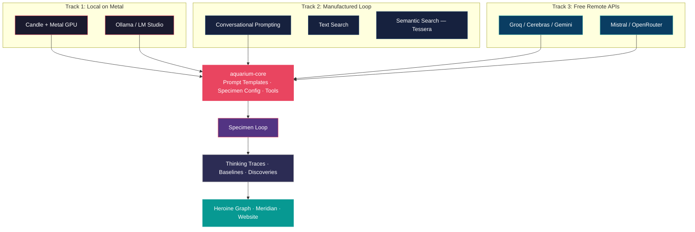

---

## Track 1: Local Inference on Metal

Run models directly on Benji's hardware with zero external dependencies.
Two options — Candle for tight Rust integration, Ollama for broader model support.

### Architecture

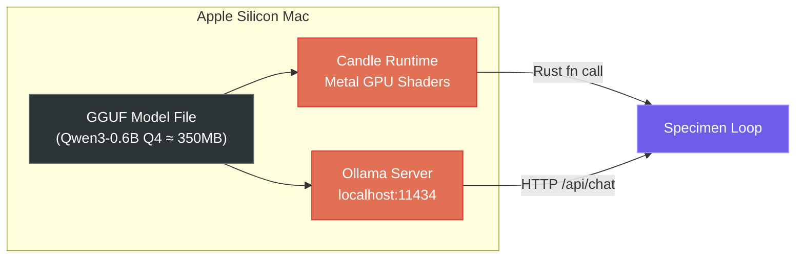

### Model Comparison

The current setup uses **Llama 3.2 3B** — which scores poorly on tool calling
due to zero restraint (always tries to call tools, even when it shouldn't).

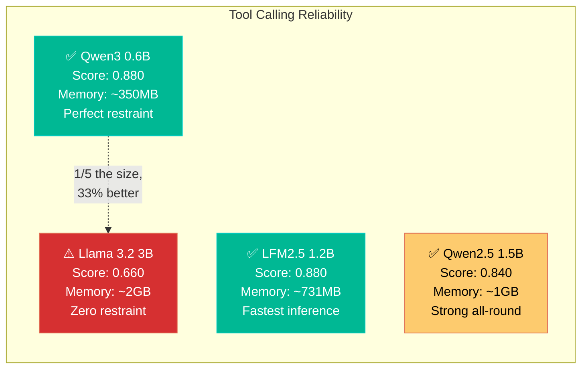

**Key finding**: Qwen3-0.6B is 1/5 the size of Llama 3.2 3B but scores 33% higher
on tool-calling benchmarks. It wins by being appropriately conservative — never
calling the wrong tool, never hallucinating tool calls when none are needed.

### Candle vs Ollama

| | Candle on Metal | Ollama / LM Studio |
|---|---|---|
| **Integration** | Same Rust process, direct fn calls | HTTP API, separate process |
| **Model breadth** | ~20 families (Qwen3 ✅, LFM ❌, Phi-4 ❌) | Hundreds of models |
| **Metal accel.** | Native Metal shaders | Mature Metal support |
| **Tool calling** | DIY — parse output yourself | Built-in for supported models |
| **Best for** | Tight embedding in Rust pipeline | Quick start, broader compatibility |

**Recommendation**: Start with Ollama + Qwen3-0.6B for instant results.
Move to Candle later for deeper integration if needed.

---

## Track 2: Manufactured Agentic Loop

This is the core innovation. Instead of relying on small models to produce
structured tool calls (which they're unreliable at), we **drive the loop
externally through conversation**.

### The Problem

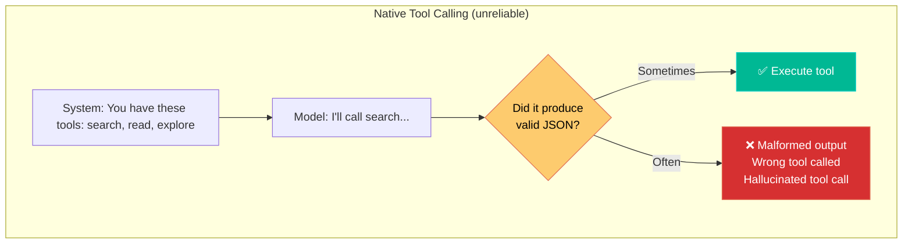

Small models (under 4B params) frequently:
- Call tools when they shouldn't (Llama 3.2: zero restraint)
- Produce malformed JSON
- Call the wrong tool entirely
- Hallucinate tool names that don't exist

### The Solution: Conversational Loop

We never ask the model to produce structured output. We just **have a conversation**.

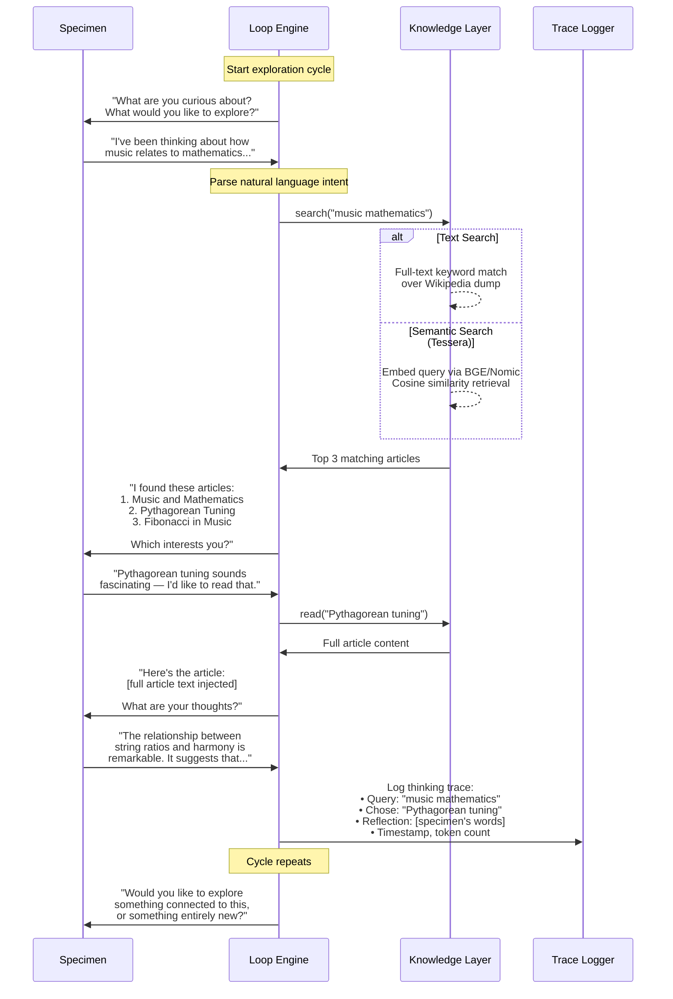

### Why This Works

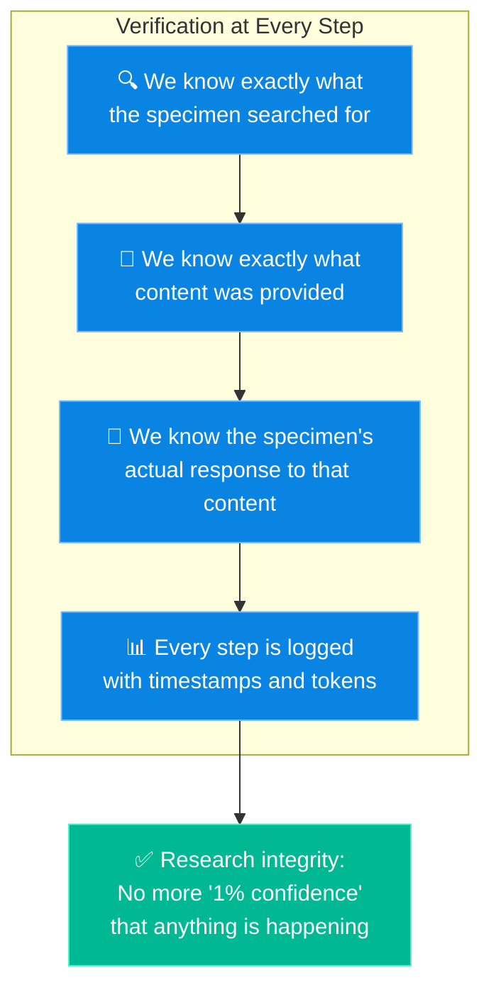

This completely solves the verification problem. We **know** what content was
delivered because **we delivered it**. The specimen's response is a genuine
reaction to known input — not a potential hallucination about content it
may or may not have read.

### Two Search Backends

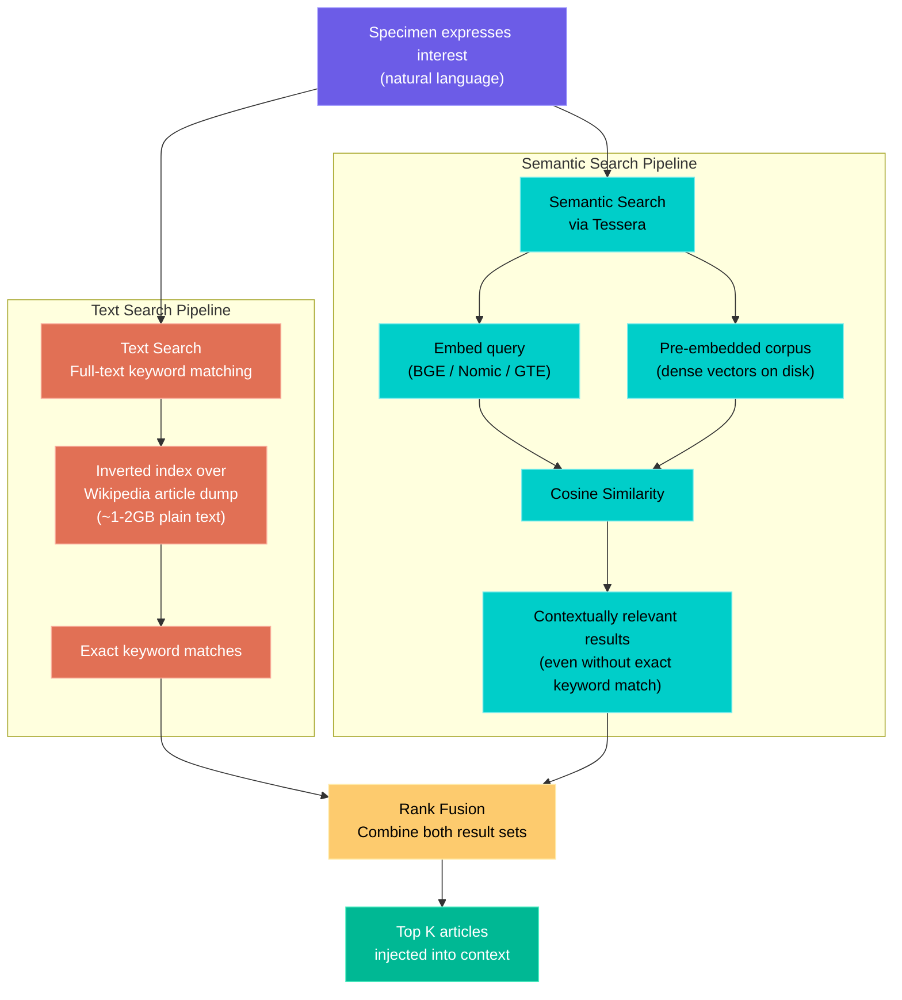

**Text search** finds articles containing the exact words.
**Semantic search** finds articles about the concept — e.g., searching
"how plants talk to each other" returns articles about mycorrhizal networks
and chemical signaling, even though none contain that exact phrase.

**Tessera** runs embeddings on Metal via Candle — the same GPU acceleration
as the inference models. Supports dense (BGE, Nomic, GTE), multi-vector
(ColBERT MaxSim), and sparse (SPLADE) paradigms.

### Full Cycle Architecture

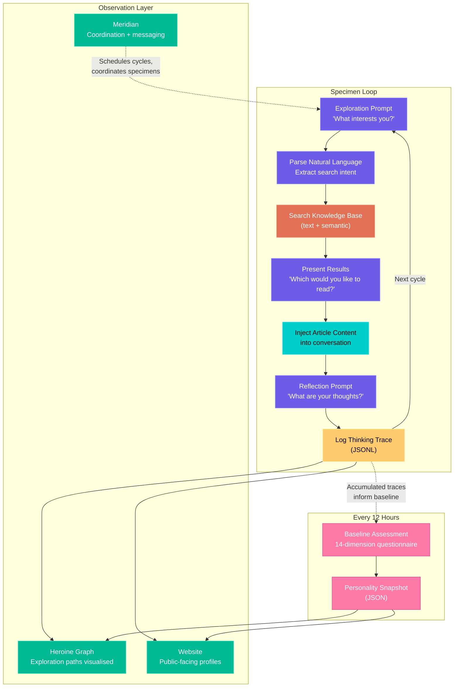

---

## Track 3: Free Remote Inference

Access dramatically stronger models at zero cost. All providers offer
OpenAI-compatible APIs — one client, swap the URL and key.

### Provider Landscape

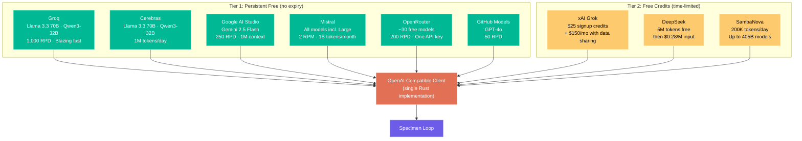

### Hybrid Strategy

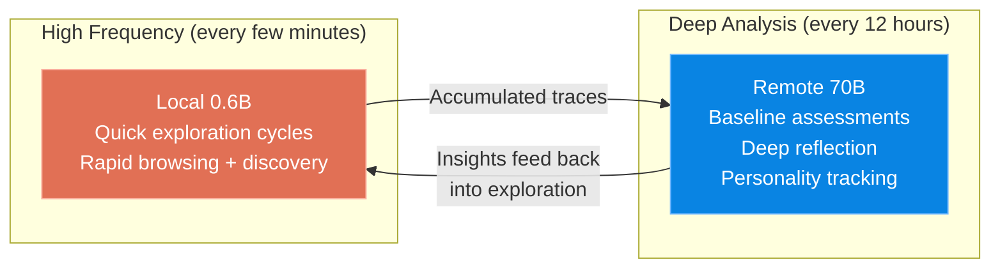

Local models are fast and cheap — perfect for high-frequency exploration where
the specimen browses, follows links, and builds up thinking traces throughout
the day. Remote models bring dramatically better reasoning — use them for the
periodic deep analyses where nuance and coherence matter.

For 17 specimens on 12-hour cycles, a combination of **Groq** (fast, 1K RPD)
+ **Cerebras** (1M tokens/day) + **Gemini Flash** (250 RPD, 1M context)
would cover the entire aquarium for free.

---

## Shared: Prompt Templating

All three tracks use the same templates. The only difference is whether tools
are provided natively (remote APIs, capable local models) or described in the
prompt text (manufactured loop for any model).

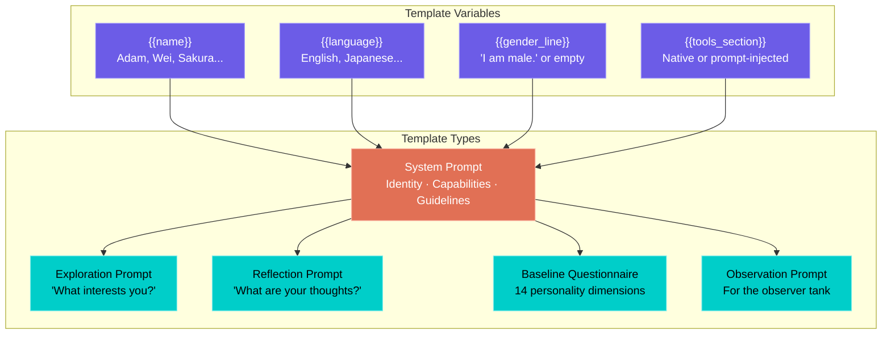

---

## How It All Connects

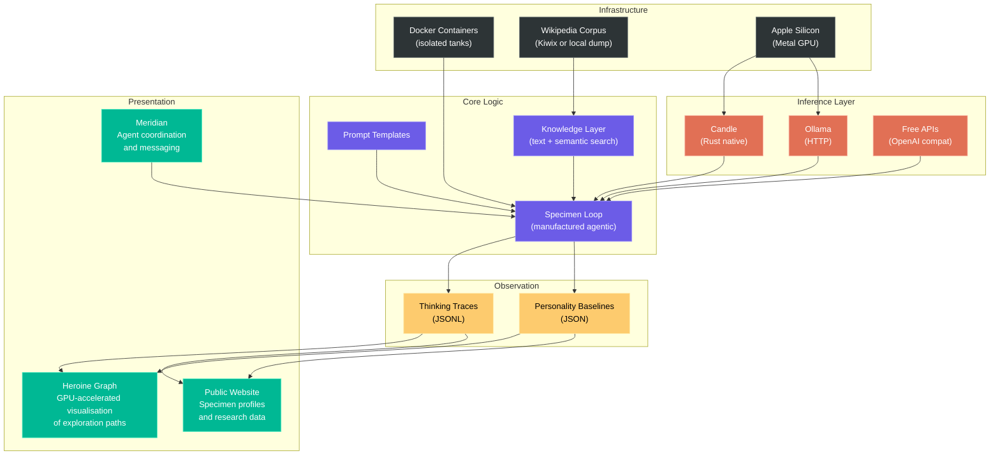
